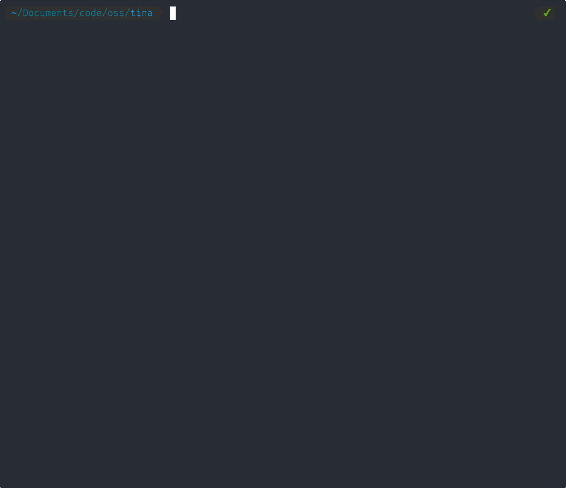

# Tina

**A strictly bounded, thread-per-core concurrency framework.** It is designed For massive concurrency, safety, and  fault-tolerance.
> Write simple, synchronous-looking state machines. Get massive multi-core throughput, automatic fault isolation, and 100% deterministic simulation testing.

[](#)
[](./LICENSE)
[](#)
[](https://twitter.com/p_mbanugo)

## A Simple TCP Echo Server

In Tina, you don't write colored `async/await` functions, and you don't lock mutexes. You write **Isolates** — lightweight state machines that react to messages and return **Effects**. The framework handles the rest.

Here's a complete, non-blocking TCP echo handler. Notice what *isn't* here: no allocations, no locks, no callbacks, no colored functions.

```odin
// Each connection is its own Isolate — no shared socket table, no lock.
EchoConnection :: struct {
    fd:     tina.FD_Handle,
    buffer: [128]u8,
}

// Initialize: set TCP_NODELAY and wait for data.
echo_init :: proc(self_raw: rawptr, args: []u8, ctx: ^tina.TinaContext) -> tina.Effect {
    self := tina.self_as(EchoConnection, self_raw, ctx)
    conn := tina.payload_as(ConnectionArgs, args)
    self.fd = conn.client_fd

    tina.ctx_setsockopt(ctx, self.fd, .IPPROTO_TCP, .TCP_NODELAY, true)

    return tina.Effect_Io{operation = tina.IoOp_Recv{fd = self.fd, buffer_size_max = size_of(self.buffer)}}
}

// Handle I/O completions synchronously. No callbacks, no hidden queues. If anything fails: let it crash.
echo_handler :: proc(self_raw: rawptr, message: ^tina.Message, ctx: ^tina.TinaContext) -> tina.Effect {
    self := tina.self_as(EchoConnection, self_raw, ctx)

    switch message.tag {
    case tina.IO_TAG_RECV_COMPLETE:
        if message.io.result <= 0 { return tina.Effect_Io{operation = tina.IoOp_Close{fd = self.fd}} }
        data := tina.ctx_read_buffer(ctx, message.io.buffer_index, u32(message.io.result))
        copy(self.buffer[:], data)
        return tina.io_send(self, self.fd, self.buffer[:len(data)])

    case tina.IO_TAG_SEND_COMPLETE:
        if message.io.result < 0 { return tina.Effect_Io{operation = tina.IoOp_Close{fd = self.fd}} }
        return tina.Effect_Io{operation = tina.IoOp_Recv{fd = self.fd, buffer_size_max = size_of(self.buffer)}}

    case tina.IO_TAG_CLOSE_COMPLETE:
        return tina.Effect_Done{}

    case:
        return tina.Effect_Receive{}
    }
}
```

If this Isolate crashes — or *segfaults* — the Shard's trap boundary catches the fault, wipes the Isolate, and the supervisor restarts it. The other Isolates on the same core never notice.



*↑ Two shards, one chaos client. Shard 1 crashes and gets quarantined. Shard 0 never stops serving. This is not a demo mode — this is just how Tina works. [Run it yourself →](./examples)*

## Features via Constraints

Tina achieves C-level performance and Erlang-level reliability by strictly limiting what you can do. Architecture solves problems better than language features.

*   🚫 **No Garbage Collection.** Memory is managed via typed arenas and Shard-owned pools. No GC pauses, no manual `free()`. Lifetimes are structurally guaranteed.
*   🚫 **No `async` / `await`.** Colored functions fragment ecosystems. Tina uses a cooperative user-space scheduler. Handlers are standard functions that return `Effect` values.
*   🚫 **No Mutexes. Shared-Nothing.** Tina runs thread-per-core. Isolates never share memory. All cross-core communication uses lock-free ring buffers (mailboxes).
*   🚫 **No Hidden Allocations.** All memory is sized and pre-allocated at startup via a static boot spec. If your workload exceeds capacity, Tina sheds load predictably rather than OOM-crashing.
*   ✅ **100% Deterministic Simulation.** The clock, network, and I/O are abstracted behind the scheduler. Tina supports TigerBeetle-style Deterministic Simulation Testing. *Same seed + same config = same execution, every time.*

## Architecture at a Glance

```
┌──────────────────────────────────────────┐  ┌──────────────────────────────────────────┐
│            SHARD 0 (Core 0)              │  │            SHARD 1 (Core 1)              │
│                                          │  │                                          │
│  ┌──────────────────────────────────┐    │  │    ┌──────────────────────────────────┐  │
│  │  Typed Arenas (per Isolate type) │    │  │    │  Typed Arenas (per Isolate type) │  │
│  │  [Session][Session][Session]...  │    │  │    │  [Timer][Timer][Timer]...        │  │
│  └──────────────────────────────────┘    │  │    └──────────────────────────────────┘  │
│                                          │  │                                          │
│  Scheduler (smart & adaptive batching)   │  │    Scheduler (smart & adaptive batching) │
│  Message Pool (128-byte envelopes)       │  │    Message Pool (128-byte envelopes)     │
│  I/O Reactor (kqueue / io_uring / IOCP)  │  │    I/O Reactor (kqueue / io_uring / IOCP)│
│  Timer Wheel · Logging · Supervision     │  │    Timer Wheel · Logging · Supervision   │
│                                          │  │                                          │
└─────────────────┬────────────────────────┘  └────────────────────────┬─────────────────┘
                  │                    Mailboxes                       │
                  └────────────────────────────────────────────────────┘
                        Lock-free cross-core messaging
```

**Shards** are OS threads, one per CPU core, pinned permanently. Each Shard owns everything it touches: arenas, scheduler, mailboxes, I/O reactor, and timers. Shards share no memory.

**Isolates** are typed structs living in dense, cache-friendly arenas inside a Shard. They are referenced by generational handles (never raw pointers), executed by the scheduler via handler functions, and can be safely invalidated without dangling references.

**Messaging** are the only way data crosses core boundaries — single-producer, single-consumer, lock-free mailbox. No atomics on the intra-shard path.

**The Grand Arena** — at boot, each Shard requests one contiguous block of memory from the OS. Every Isolate, every message envelope, every I/O buffer is carved from this block. After boot, `malloc` is never called.

## Deterministic Simulation Testing

Because Tina controls the clock, the network, and the I/O, you can simulate network partitions, dropped messages, and disk failures on a single thread with a reproducible seed.

This is the same technique used by [TigerBeetle](https://tigerbeetle.com/) and [FoundationDB](https://www.youtube.com/watch?v=4fFDFbi3toc) to find bugs that stress tests miss. In simulation mode, the Effect interpreter is swapped — `.io` returns canned completions, time advances deterministically. However, your Isolate code is the same in both modes.

**Same seed + same config = same execution order.** Every race condition, every edge case, reproducible on demand. See the [full DST guide](./src/README_DST.md) for writing simulation tests, configuring fault injection, and reproducing failures.

## Quickstart

```sh
# Clone
git clone https://github.com/pmbanugo/tina.git && cd tina

# Build and run the TCP echo example (two shards, fault injection, supervisor recovery)
odin build examples/example_tcp_echo.odin -file -out:tina_echo
./tina_echo

# Build and run the task dispatcher (workers crash, supervisors restart them)
odin build examples/example_task_dispatcher.odin -file -out:tina_dispatch
./tina_dispatch
```

The echo example runs a two-shard TCP server. A chaos client crashes after a few round-trips, so you can watch the supervisor restart it while the other shard keeps serving. See [`/examples`](./examples) for full walkthroughs and compile-time knobs.

## Documentation

| Section | What it covers |
|---|---|
| **Concepts** | |
| [`docs/concepts/isolates.md`](./docs/concepts/isolates.md) | Isolates, Effects & Messaging — the core mental model |
| [`docs/concepts/thread_per_core.md`](./docs/concepts/thread_per_core.md) | Thread-per-core architecture, shared-nothing Shards, cross-shard messaging, budgeted batching |
| [`docs/concepts/memory_arenas.md`](./docs/concepts/memory_arenas.md) | Grand Arena, three memory generations, typed arenas, hardware prefetcher alignment |
| [`docs/concepts/supervision.md`](./docs/concepts/supervision.md) | Supervision & fault tolerance — "let it crash", restart strategies, quarantine |
| [`docs/concepts/io_and_data_flow.md`](./docs/concepts/io_and_data_flow.md) | I/O model, reactor buffers, transfer buffers, the "one rule" |
| [`docs/concepts/deterministic_simulation.md`](./docs/concepts/deterministic_simulation.md) | Simulation testing, PRNG tree, fault injection, structural checkers |
| [`docs/concepts/backpressure_and_drops.md`](./docs/concepts/backpressure_and_drops.md) | Bounded mailboxes, drop-on-full semantics, control plane/data plane separation |
| **Guides** | |
| [`docs/guides/building_a_tcp_server.md`](./docs/guides/building_a_tcp_server.md) | Build a complete TCP echo server from scratch |
| [`docs/guides/handling_state_machines.md`](./docs/guides/handling_state_machines.md) | Reactive handlers, lifecycle state machines, the dispatcher-worker pattern |
| [`docs/guides/graceful_shutdown.md`](./docs/guides/graceful_shutdown.md) | TAG_SHUTDOWN handling, drain patterns, three-phase shutdown protocol |
| [`docs/guides/working_with_memory.md`](./docs/guides/working_with_memory.md) | Scratch vs working arena, transfer buffers, the decision rule |
| [`docs/guides/writing_simulation_tests.md`](./docs/guides/writing_simulation_tests.md) | Writing deterministic simulation tests — TestDrivers, checkers, fault config |
| [`docs/guides/designing_shard_topologies.md`](./docs/guides/designing_shard_topologies.md) | Mapping applications to Shards — symmetric, asymmetric, the Coordinator pattern |
| [`docs/guides/tuning_the_boot_spec.md`](./docs/guides/tuning_the_boot_spec.md) | Sizing every knob — pools, mailboxes, channels, buffers, timers, workload profiles |
| **Reference** | |
| [`docs/reference/the_ctx_api.md`](./docs/reference/the_ctx_api.md) | Complete `ctx` API — messaging, spawning, memory, I/O, timers, all types |
| [`docs/reference/system_spec.md`](./docs/reference/system_spec.md) | SystemSpec, ShardSpec, TypeDescriptor, supervision, simulation config |
| **Examples** | |
| [`examples/`](./examples) | Runnable examples with detailed walkthroughs |
| [`src/README_DST.md`](./src/README_DST.md) | Deterministic Simulation Testing — writing tests, fault injection, reproducing failures |

## Production Readiness & Status

**Status: Early but Functionally Stable.**

Tina is in an early but functional state. The core architecture is implemented and working:

- ✅ Thread-per-core scheduler with adaptive-batched execution
- ✅ Fault isolation (trap boundary catches panics *and* segfaults)
- ✅ Supervision trees with restart budgets and shard quarantine
- ✅ Async I/O via kqueue (macOS), io_uring (Linux), and IOCP (Windows)
- ✅ Cross-shard, multi-core messaging
- ✅ Two working examples demonstrating fault recovery under load
- ✅ Deterministic simulation testing with fault injection, structural checkers, and seed-based replay
- ✅ Documentation: concept guides, how-to guides, and API reference

Tested primarily on macOS (Apple Silicon). CI tests pass on Linux and Windows. If you find a bug, open an issue. If you want to discuss the design, open a GitHub Discussion.

## Inspirations & Acknowledgments

Tina did not invent its ideas. It synthesizes them:

| Idea | My Source |
|---|---|
| Supervision trees, "Let it Crash", Error Kernel | Joe Armstrong — Erlang/OTP |
| Thread-per-core, shared-nothing, reactor loop | Seastar by ScyllaDB |
| Deterministic simulation testing, static allocation, Tiger Style | TigerBeetle & FoundationDB |
| Ring buffer design, mechanical sympathy | Martin Thompson — LMAX Disruptor, Aeron |
| Memory Lifetimes | Casey Muratori |
| Data-oriented design | Mike Acton (C++) & Andrew Kelly (Zig) |
| Architecting large software projects | Eskil Steenberg (C developer) |

## Sponsorship & Support

Tina is an independent, open-source engineering project. It is not backed by venture capital, which allows it to remain strictly focused and fiercely uncompromising on its architecture. 

If you or your team is evaluating Tina for high-throughput infrastructure, or if you simply want to advance zero-allocation systems research and engineering, consider [becoming a sponsor on GitHub](https://github.com/sponsors/pmbanugo). Corporate sponsors receive priority issue triage and architectural advisory.

## Following the Build

I'm writing about the engineering decisions behind Tina — the tradeoffs, the influences, and the ideas that didn't make it.

→ [pmbanugo.me](https://pmbanugo.me)

## License

[Apache 2.0](./LICENSE)
